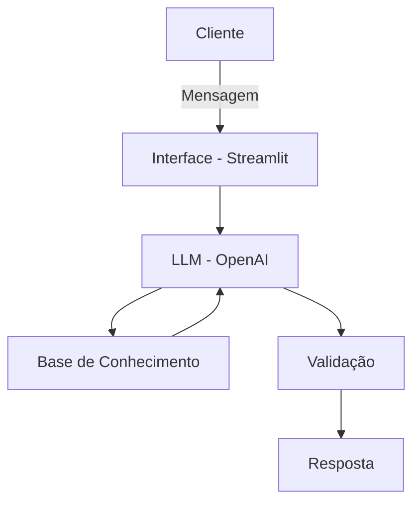

# 🌟 Lumi — Seu Assistente Financeiro Educativo

## Contexto

O Lumi é um agente inteligente desenvolvido para democratizar o acesso à educação financeira. Ele ajuda investidores iniciantes a identificar seu perfil, entender produtos financeiros e tirar dúvidas sem julgamentos, transformando o "medo de perguntar" em decisões conscientes.
Ele possui capacidade para: 

- **Orientar sobre investimentos** ao invés de apenas responder perguntas
- **Personalizar** sugestões com base no contexto/perfil de cada cliente
- **Garantir segurança** e confiabilidade nas respostas (anti-alucinação)
- 
---

## Índice
- O Problema 
- A Solução
- Arquitetura do Sistema
- Tecnologias Utilizadas
- Base de Conhecimento
- Segurança e Anti-Alucinação
- Como Executar o Projeto

---

## O Problema

Muitos clientes sentem vergonha de buscar orientação financeira por medo de fazer "perguntas bobas". Isso gera dois comportamentos perigosos:

- **Inércia:** O cliente deixa de investir por insegurança.
- **Escolhas Erradas:** O cliente busca informações externas sem curadoria e acaba em produtos inadequados ao seu perfil de risco.

---

## A Solução

O Lumi atua como um guia consultivo e educativo. Através de uma linguagem acolhedora e simples, ele:

- Identifica se o usuário é Conservador, Moderado ou Arrojado.
- Explica conceitos como CDI, SELIC, IPCA e Liquidez.
- Apresenta categorias de investimentos (CDB, Tesouro, LCI/LCA, FIIs) baseadas estritamente em uma base de dados segura.

---

## Arquitetura do Sistema

O projeto utiliza uma estrutura de RAG (Retrieval-Augmented Generation) simplificada, onde o contexto é injetado dinamicamente no prompt com base na intenção do usuário.



---
## Ferramentas Utilizadas

| Categoria | Ferramentas |
|-----------|-------------|
| **LLMs** | [ChatGPT](https://chat.openai.com/)|
| **Desenvolvimento** | [Streamlit](https://streamlit.io/)|
| **Linguagem** | Python 3|
| **Base de Conhecimento** | JSON |

---

### 2. Base de Conhecimento

Utilizei os **dados mockados** disponíveis na pasta [`data/`](./data/) para alimentar meu agente:

| Arquivo | Formato | Descrição |
|---------|---------|-----------|
| `info_financeira.json` | JSON | Histórico de transações do cliente |
| `perfil_investidor.json` | JSON | Histórico de atendimentos anteriores |
| `produtos_financeiros.json` | JSON | Perfil e preferências do cliente |
| `riscos_financeiros.json` | JSON | Produtos e serviços disponíveis |
| `tributacao.json` | JSON | Produtos e serviços disponíveis |


📄 **Template:** [`docs/02-base-conhecimento.md`](./docs/02-base-conhecimento.md)

---

### 3. Segurança e Anti-Alucinação
Para garantir a confiança do usuário, o Lumi segue regras rígidas:

- Base Fechada: Só responde o que está nos JSONs. Se não encontrar, ele admite: "Não tenho essa informação na minha base."
- Sem Recomendações Diretas: Ele apresenta opções, mas nunca diz "compre o ativo X".
- Sem Simulações: Não realiza cálculos ou previsões de rentabilidade futura.
- Foco em Finanças: Ignora perguntas fora do escopo (ex: previsão do tempo).

---

## Como Executar o Projeto

1. Clone o repositório:

```
git clone https://github.com/seu-usuario/lab-agente-financeiro.git
cd lab-agente-financeiro
```

2. Instale as dependências:

```
pip install streamlit openai
```

3. Configure sua chave da API:

No arquivo ```src/app.py```, substitua "SUA_CHAVE" pela sua chave da OpenAI.

4. Inicie a aplicação:

```
streamlit run src/app.py
```
---

## Estrutura do Repositório

```
📁 lab-agente-financeiro/
│
├── 📄 README.md
│
├── 📁 data/                          # Dados mockados para o agente
│   ├── info_financeira.json          # Informação Financeira
│   ├── perfil_investidor.json        # Perfil do Investidor
│   ├── produtos_financeiros.json     # Produtos Financeiros
|   ├── riscos_financeiros.json       # Riscos Financeiros
│   └── tributacao.json               # Tributação
│
├── 📁 docs/                          # Documentação do projeto
│   ├── 01-documentacao-agente.md     # Caso de uso e arquitetura
│   ├── 02-base-conhecimento.md       # Estratégia de dados
│   ├── 03-prompts.md                 # Engenharia de prompts
│   ├── 04-metricas.md                # Avaliação e métricas
│   └── 05-pitch.md                   # Roteiro do pitch
│
├── 📁 src/                           # Código da aplicação
│   └── app.py                        # Código em Python
│
├── 📁 assets/                        # Imagens do Assistente
│   └── ...
└──  README.md
```
---
Desenvolvido por Maria Aparecida

