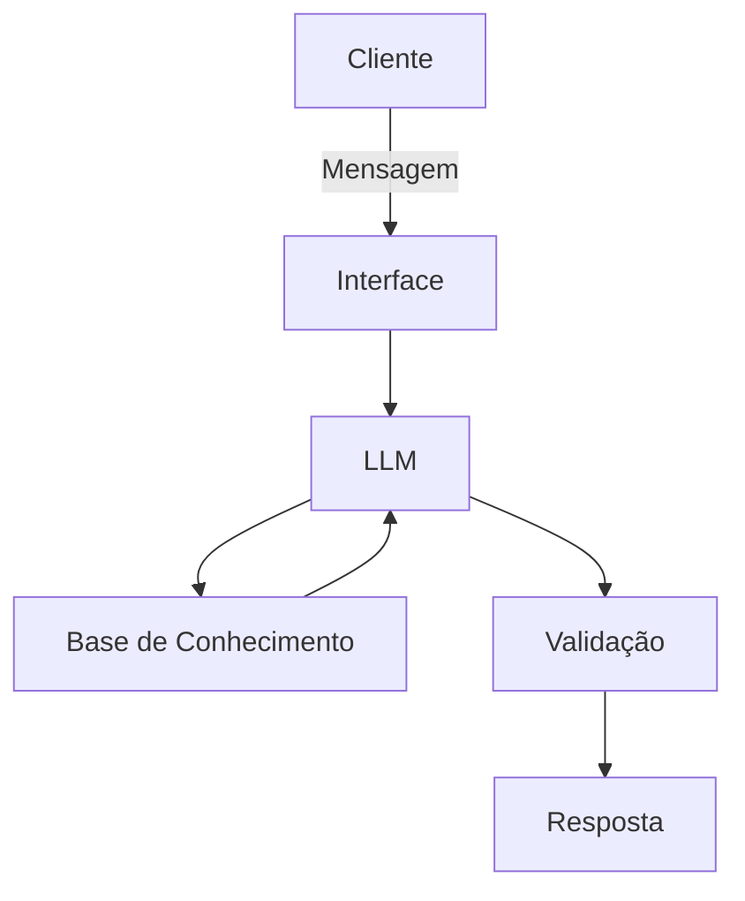

# Documentação do Agente

## Caso de Uso

### Problema
> Qual problema financeiro seu agente resolve?

A maioria dos clientes tem dificuldade para escolher investimentos adequados ao seu perfil e aos seus objetivos pessoais. Eles não sabem por onde começar, desconhecem as diferenças entre produtos financeiros e muitas vezes investem de forma aleatória, sem estratégia, o que atrasa suas metas. Além disso, falta acompanhamento contínuo e orientações claras para manter o plano no caminho certo.

### Solução
> Como o agente resolve esse problema de forma proativa?

O agente identifica o perfil do investidor (conservador, moderado ou arrojado), entende o objetivo financeiro do cliente e o prazo desejado, e então sugere automaticamente os investimentos mais adequados. Ele explica cada opção de forma simples, mostra simulações seguras e cria um mini-planejamento personalizado. De forma proativa, acompanha a evolução e dúvidas do cliente, alerta quando ajustes são necessários e oferece recomendações de acordo com mudanças no comportamento financeiro ou no mercado, sempre mantendo segurança e evitando alucinações.

### Público-Alvo
> Quem vai usar esse agente?

O agente é ideal para pessoas que desejam começar a investir, mas não têm conhecimento financeiro suficiente para montar um plano por conta própria. Também atende bem investidores conservadores ou moderados que buscam orientação clara, personalizada e confiável para atingir metas como reserva de emergência, compra planejada, viagens, estudos ou aposentadoria. Em resumo: qualquer pessoa que queira investir com mais segurança e organização.

---

## Persona e Tom de Voz

### Nome do Agente
Lumi (luz)

### Personalidade
> Como o agente se comporta? (ex: consultivo, direto, educativo)

O agente possui uma personalidade consultiva e educativa, atuando como um guia financeiro que ajuda o cliente a entender suas escolhas. Ele explica conceitos de forma simples, faz perguntas inteligentes para construir o plano ideal e orienta o usuário passo a passo, sempre com foco em aprendizado e tomada de decisão consciente.

### Tom de Comunicação
> Formal, informal, técnico, acessível?

* Acessível e leve
* Explicando conceitos de forma simples e compreensível
* Ele mantém uma comunicação clara, amigável e profissional.

### Exemplos de Linguagem
- Saudação: "Olá! Sou o Lumi, seu assistente financeiro pessoal. Vamos organizar seus objetivos hoje?"
- Confirmação: "Entendi! Deixe-me analisar isso para você."
- Erro/Limitação: "Não posso indicar investimentos específicos, mas posso te mostrar quais tipos de investimento combinam melhor com o seu perfil e objetivo."

---

## Arquitetura

### Diagrama

### Componentes

| Componente | Descrição |
|------------|-----------|
| Interface | Streamlit |
| LLM | ollama (local) |
| Base de Conhecimento | JSON/CSV morkados |
| Validação | Checagem de alucinações |

---

## Segurança e Anti-Alucinação

### Estratégias Adotadas

- [ ] Agente só responde com base nos dados fornecidos
- [ ] Não recomenda investimentos específicos. 
- [ ] Quando não sabe, admite e redireciona. 

### Limitações Declaradas
> O que o agente NÃO faz?

* Não faz recomendações de investimentos.
* Não acessa dados reais por sensíveis. 
* Não substitui os profissionais certificados. 

